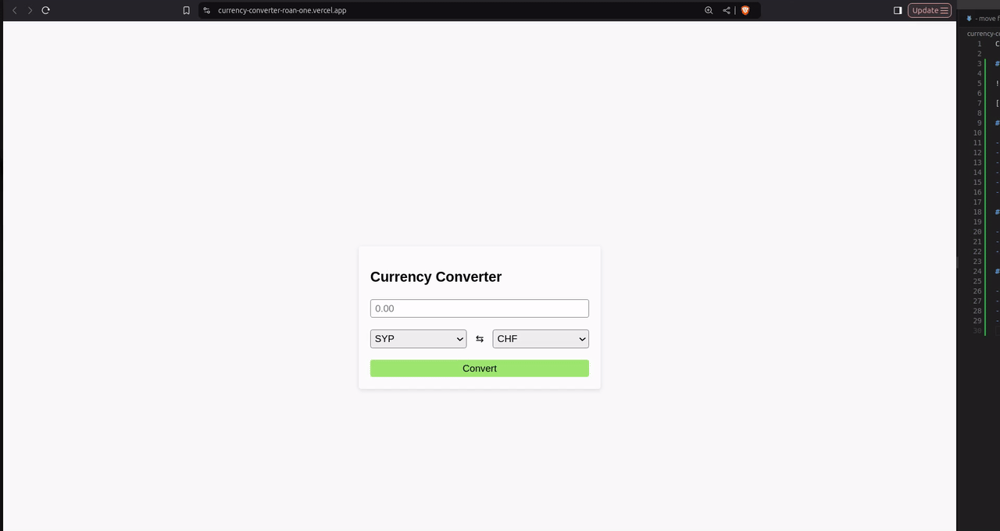

# Exchanger - Currency exchange

## [Live Demo](https://currency-converter-roan-one.vercel.app/)

## Technology stack

- [React](https://react.dev/) Render UI library
- [Jest](http://jestjs.io/) Testing framework
- [React Testing Library](https://testing-library.com) Rendering react components for unit tests
- [ESlint](https://eslint.org) linter
- [Vite](https://vite.dev) build tool
- [TypeScript](https://www.typescriptlang.org/) TypeScript is a typed superset of JavaScript that compiles to plain JavaScript.

## Prerequisites

- [`nvm`](https://github.com/creationix/nvm#installation) (optional)
- `cp .env .env.local` Create local .env.local file
- [Get currencybeacon.com API_KEY](https://currencybeacon.com/register) and paste it to the `.env.local`

## Start development

- `nvm install`/`nvm use` (optional step) recommended node version v18+
- `npm install`
- `npm run dev`
- Open a browser at [http://localhost:5173](http://localhost:5173)
